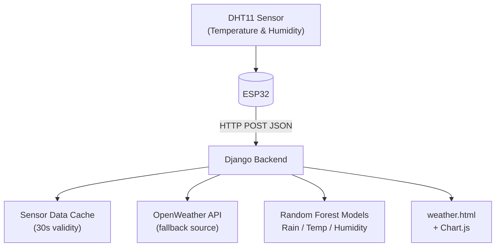
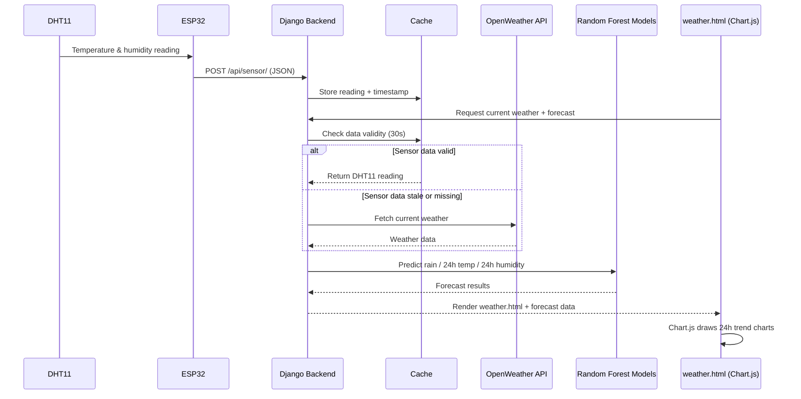

# AI-Powered Weather Monitoring and Forecasting System

[Tiếng Việt](./README.vi.md) | **English**

An IoT + AI weather monitoring system built on **ESP32** and **DHT11**, combined with a **Django** backend that runs **Random Forest** models to forecast rain, temperature, and humidity for the next 24 hours, displayed on a real-time web dashboard.

---

## Overview

This project collects environmental data from a physical sensor and combines it with machine learning to go beyond simple monitoring into forecasting:
- Reads temperature and humidity from a **DHT11** sensor via **ESP32**
- Falls back to the **OpenWeather API** when sensor data is unavailable or stale
- Predicts rain for tomorrow using a **Random Forest Classifier**
- Forecasts temperature and humidity for the next 24 hours using two **Random Forest Regressors**
- Displays current conditions and 24-hour forecasts on a responsive web dashboard with **Chart.js**

**Tech stack:** ESP32 · DHT11 · Django · scikit-learn (Random Forest) · OpenWeather API · Visual Crossing (historical data) · Chart.js · joblib

---

## System Block Diagram



**Components:**

| Component | Role |
|---|---|
| DHT11 | Measures ambient temperature and humidity |
| ESP32 | Reads sensor data, packages it as JSON, sends it to the backend over HTTP |
| Django Backend | Receives sensor data, caches it, calls OpenWeather API when needed, runs the AI models, renders the dashboard |
| OpenWeather API | Fallback data source when sensor data is unavailable or expired |
| Random Forest Models | Predict rain for tomorrow and forecast temperature/humidity for the next 24 hours |
| weather.html + Chart.js | Displays current conditions and 24-hour forecast trend charts |

---

## Hardware Image

<p align="center">
  
</p>

ESP32 and DHT11 wiring overview.

---

## Web Dashboard

Dashboard showing current weather data sourced from the DHT11 sensor via ESP32, along with the 24-hour temperature and humidity forecast.


Dashboard falling back to the OpenWeather API when sensor data is unavailable or expired, indicating the active data source to the user.


---

## Data Flow Description

1. **Sensing** — ESP32 reads temperature and humidity from the DHT11 sensor.
2. **Transmission** — ESP32 sends the reading to Django as an HTTP POST request with a JSON body (`temperature`, `humidity`).
3. **Caching** — Django stores the sensor reading in cache along with the timestamp it was received.
4. **Request** — When the user opens the dashboard, the frontend requests the current weather and the user's location.
5. **Validity Check** — Django checks whether the cached sensor data is still within the valid time window (30 seconds).
6. **Source Selection** — If the cached data is still valid, the system uses the DHT11 reading; if it's stale or missing, the system falls back to the OpenWeather API.
7. **Forecasting** — Django feeds the current weather data into the Random Forest models to predict tomorrow's rain status and the next 24 hours of temperature and humidity.
8. **Rendering** — Results are rendered into `weather.html`, and Chart.js draws the 24-hour temperature and humidity trend charts on the dashboard.



---

## AI Models

All models are trained on roughly 8,640 hourly historical records from **Visual Crossing**, covering Jan 1 – Dec 26, 2025. Input features include `MinTemp`, `MaxTemp`, `WindGustDir`, `WindGustSpeed`, `Humidity`, `Pressure`, `Temp`, `Hour`, and `Month`.

| Model | Type | Purpose |
|---|---|---|
| Rain Prediction | RandomForestClassifier | Predicts Rain / No Rain for tomorrow |
| Temperature Forecast | RandomForestRegressor | Iteratively forecasts temperature for the next 24 hours |
| Humidity Forecast | RandomForestRegressor | Iteratively forecasts humidity for the next 24 hours |

The regression models forecast iteratively: each hour's predicted value becomes the input for predicting the next hour. Trained models are persisted with `joblib` (`.pkl` files) so the backend loads them at startup instead of retraining on every request.

---

## Performance

Measured on the implemented system:

| Metric | Result |
|---|---|
| ESP32 → Django sensor data response time | ~0.08s |
| OpenWeather API call | ~0.41s |
| Model load time (`joblib.load()`) | ~0.15s |
| Rain prediction | ~0.006s |
| 24h temperature forecast | ~0.09s |
| 24h humidity forecast | ~0.09s |
| Full dashboard request (`weather_view()`) | ~3.35s |

---

## Features

- Real-time temperature and humidity monitoring via DHT11 + ESP32
- Automatic fallback to OpenWeather API when sensor data is unavailable or stale
- Next-day rain prediction (Random Forest Classifier)
- 24-hour temperature forecast (Random Forest Regressor)
- 24-hour humidity forecast (Random Forest Regressor)
- Web dashboard with Chart.js trend visualization
- Active data source indicator (DHT11 sensor vs. OpenWeather API)
- Model persistence via joblib — no retraining needed on every run

## Hardware Used

- ESP32 Dev Board
- DHT11 Temperature & Humidity Sensor

## Overall Project Structure

```
weather-monitoring-system/
├── README.md                        # System overview (this file, English)
├── README.vi.md                     # System overview (Vietnamese)
├── firmware/                        # ESP32 + DHT11 firmware (PlatformIO)
│   ├── src/
│   │   ├── main.cpp
│   │   └── secrets.example.h
│   ├── include/
│   ├── lib/
│   └── platformio.ini
├── weatherProject/                  # Django backend + web dashboard
│   ├── forecast/                    # Main app: views, API endpoint, model logic
│   ├── models/                      # Trained Random Forest models (.pkl)
│   ├── templates/
│   │   └── weather.html
│   ├── static/
│   │   ├── css
│   │   │   └── styles.css           # Modify UI
│   │   ├── img                      # Background images for web interface
│   │   └── js                       # Setup chart logic
│   │       └── chartSetup.js  
│   └── manage.py
└── images/                          # Hardware images and dashboard screenshots
    ├── hardware_overview.png
    ├── web_interface1.png
    └── web_interface2.png
...
```

## Getting Started

1. Go to `firmware/README.md` to build and flash the firmware onto the ESP32, and wire the DHT11 according to the hardware image above.
2. Go to `weatherProject/README.md` to install dependencies, configure your OpenWeather API key, and run the Django server.
3. Power on the ESP32 — it will start sending sensor readings to the Django backend.
4. Open the dashboard in your browser to view current weather and the 24-hour forecast.

