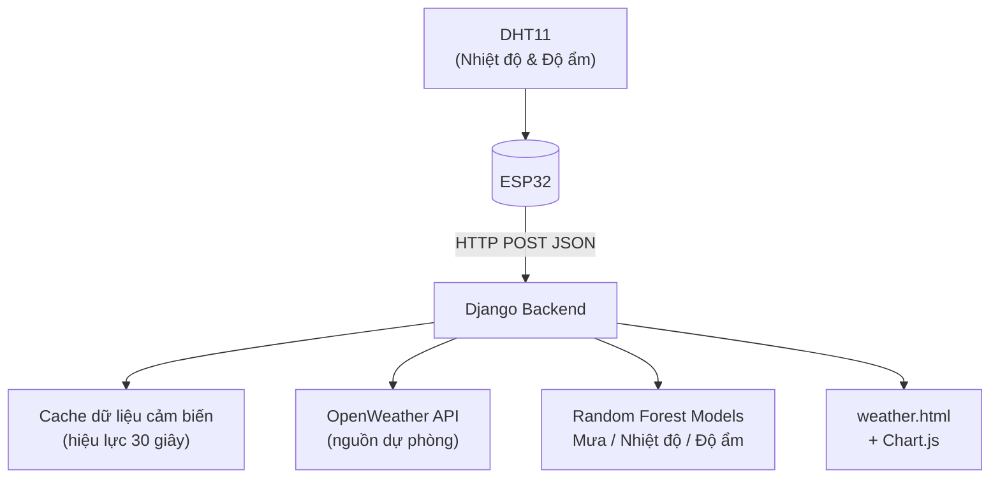
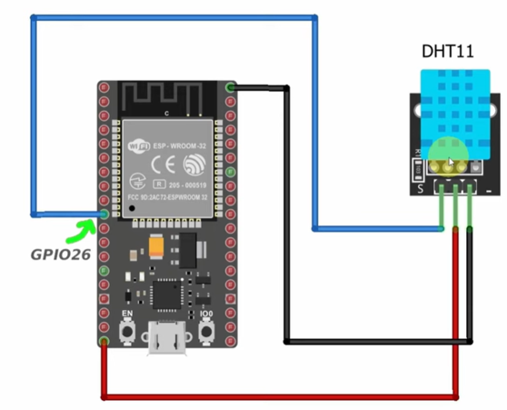
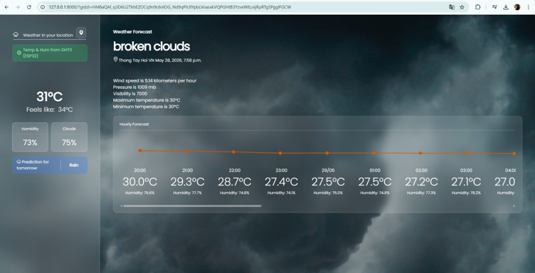
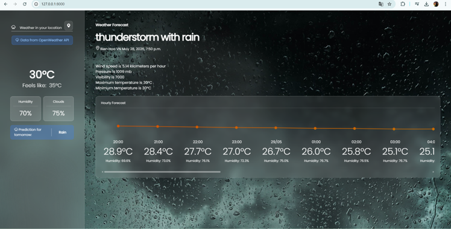
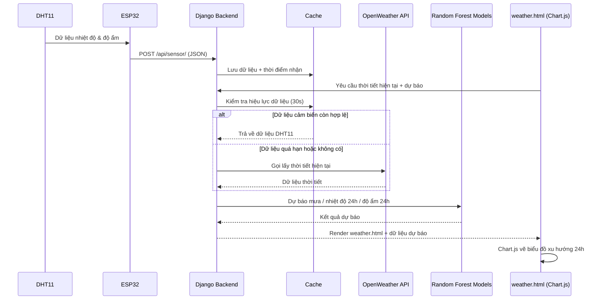

# Hệ Thống Theo Dõi Và Dự Báo Thời Tiết Bằng AI

**Tiếng Việt** | [English](./README.md)

Hệ thống giám sát thời tiết ứng dụng IoT + AI, xây dựng trên **ESP32** và **DHT11**, kết hợp với backend **Django** chạy các mô hình **Random Forest** để dự báo mưa, nhiệt độ và độ ẩm trong 24 giờ tiếp theo, hiển thị trên web dashboard theo thời gian thực.

---

## Tổng Quan

Dự án này thu thập dữ liệu môi trường từ cảm biến vật lý và kết hợp với học máy để không chỉ dừng lại ở giám sát mà còn dự báo:
- Đọc nhiệt độ và độ ẩm từ cảm biến **DHT11** thông qua **ESP32**
- Sử dụng **OpenWeather API** làm nguồn dự phòng khi dữ liệu cảm biến không khả dụng hoặc quá hạn
- Dự báo khả năng mưa ngày mai bằng **Random Forest Classifier**
- Dự báo nhiệt độ và độ ẩm trong 24 giờ tiếp theo bằng hai mô hình **Random Forest Regressor**
- Hiển thị thời tiết hiện tại và dự báo 24 giờ trên web dashboard responsive với **Chart.js**

**Công nghệ sử dụng:** ESP32 · DHT11 · Django · scikit-learn (Random Forest) · OpenWeather API · Visual Crossing (dữ liệu lịch sử) · Chart.js · joblib

---

## Sơ Đồ Khối Hệ Thống



**Các thành phần:**

| Thành phần | Vai trò |
|---|---|
| DHT11 | Đo nhiệt độ và độ ẩm môi trường |
| ESP32 | Đọc dữ liệu cảm biến, đóng gói JSON, gửi lên backend qua HTTP |
| Django Backend | Nhận dữ liệu cảm biến, cache lại, gọi OpenWeather API khi cần, chạy mô hình AI, render dashboard |
| OpenWeather API | Nguồn dữ liệu dự phòng khi dữ liệu cảm biến không khả dụng hoặc quá hạn |
| Random Forest Models | Dự báo khả năng mưa ngày mai và dự báo nhiệt độ/độ ẩm trong 24 giờ tới |
| weather.html + Chart.js | Hiển thị thời tiết hiện tại và biểu đồ xu hướng dự báo 24 giờ |

---

## Hình Ảnh Phần Cứng

<p align="center">
  
</p>

Sơ đồ đi dây ESP32 và DHT11.

---

## Web Dashboard
Dashboard hiển thị dữ liệu thời tiết hiện tại lấy từ cảm biến DHT11 thông qua ESP32, kèm dự báo nhiệt độ và độ ẩm trong 24 giờ tiếp theo.



Dashboard chuyển sang dùng OpenWeather API khi dữ liệu cảm biến không khả dụng hoặc quá hạn, đồng thời hiển thị rõ nguồn dữ liệu đang được sử dụng.



---

## Mô Tả Luồng Dữ Liệu

1. **Đo lường** — ESP32 đọc dữ liệu nhiệt độ và độ ẩm từ cảm biến DHT11.
2. **Truyền dữ liệu** — ESP32 gửi dữ liệu lên Django bằng HTTP POST với JSON body (`temperature`, `humidity`).
3. **Lưu cache** — Django lưu dữ liệu cảm biến vào cache kèm thời điểm nhận được.
4. **Yêu cầu** — Khi người dùng mở dashboard, frontend gửi yêu cầu lấy thời tiết hiện tại cùng vị trí người dùng.
5. **Kiểm tra hiệu lực** — Django kiểm tra dữ liệu cảm biến trong cache còn trong khoảng thời gian hợp lệ hay không (30 giây).
6. **Chọn nguồn dữ liệu** — Nếu dữ liệu cache còn hợp lệ, hệ thống dùng dữ liệu từ DHT11; nếu quá hạn hoặc không tồn tại, hệ thống chuyển sang dùng OpenWeather API.
7. **Dự báo** — Django đưa dữ liệu thời tiết hiện tại vào các mô hình Random Forest để dự báo khả năng mưa ngày mai và nhiệt độ/độ ẩm trong 24 giờ tới.
8. **Hiển thị** — Kết quả được render ra `weather.html`, Chart.js vẽ biểu đồ xu hướng nhiệt độ và độ ẩm trong 24 giờ trên dashboard.



---

## Mô Hình AI

Tất cả mô hình được huấn luyện trên khoảng 8.640 dòng dữ liệu lịch sử hourly từ **Visual Crossing**, trong giai đoạn 01/01/2025 đến 26/12/2025. Đặc trưng đầu vào gồm `MinTemp`, `MaxTemp`, `WindGustDir`, `WindGustSpeed`, `Humidity`, `Pressure`, `Temp`, `Hour`, và `Month`.

| Mô hình | Loại | Mục đích |
|---|---|---|
| Dự báo mưa | RandomForestClassifier | Dự báo Rain / No Rain cho ngày mai |
| Dự báo nhiệt độ | RandomForestRegressor | Dự báo nhiệt độ lặp lại theo từng giờ trong 24 giờ tới |
| Dự báo độ ẩm | RandomForestRegressor | Dự báo độ ẩm lặp lại theo từng giờ trong 24 giờ tới |

Các mô hình hồi quy dự báo theo kiểu lặp: giá trị dự đoán của giờ trước được dùng làm đầu vào để dự đoán giờ kế tiếp. Mô hình sau khi train được lưu lại bằng `joblib` (file `.pkl`), giúp backend chỉ cần load mô hình khi khởi động thay vì train lại mỗi lần có request.

---

## Hiệu Năng

Đo trên hệ thống thực tế đã triển khai:

| Chỉ số | Kết quả |
|---|---|
| Thời gian phản hồi ESP32 → Django | ~0.08 giây |
| Thời gian gọi OpenWeather API | ~0.41 giây |
| Thời gian load model (`joblib.load()`) | ~0.15 giây |
| Thời gian dự báo mưa | ~0.006 giây |
| Thời gian dự báo nhiệt độ 24 giờ | ~0.09 giây |
| Thời gian dự báo độ ẩm 24 giờ | ~0.09 giây |
| Tổng thời gian phản hồi dashboard (`weather_view()`) | ~3.35 giây |

---

## Tính Năng

- Giám sát nhiệt độ và độ ẩm theo thời gian thực qua DHT11 + ESP32
- Tự động chuyển sang OpenWeather API khi dữ liệu cảm biến không khả dụng hoặc quá hạn
- Dự báo khả năng mưa ngày mai (Random Forest Classifier)
- Dự báo nhiệt độ 24 giờ tới (Random Forest Regressor)
- Dự báo độ ẩm 24 giờ tới (Random Forest Regressor)
- Web dashboard với biểu đồ xu hướng bằng Chart.js
- Hiển thị rõ nguồn dữ liệu đang dùng (cảm biến DHT11 hay OpenWeather API)
- Lưu mô hình bằng joblib — không cần train lại mỗi lần chạy

## Phần Cứng Sử Dụng

- ESP32 Dev Board
- Cảm biến nhiệt độ & độ ẩm DHT11

## Cấu Trúc Project

```
weather-monitoring-system/
├── README.md                        # System overview (this file, English)
├── README.vi.md                     # System overview (Vietnamese)
├── firmware/                        # ESP32 + DHT11 firmware (PlatformIO)
│   ├── src/
│   │   ├── main.cpp
│   │   └── secrets.example.h
│   ├── include/
│   ├── lib/
│   └── platformio.ini
├── weatherProject/                  # Django backend + web dashboard
│   ├── forecast/                    # Main app: views, API endpoint, model logic
│   ├── models/                      # Trained Random Forest models (.pkl)
│   ├── templates/
│   │   └── weather.html
│   ├── static/
│   │   ├── css
│   │   │   └── styles.css           # Modify UI
│   │   ├── img                      # Background images for web interface
│   │   └── js                       # Setup chart logic
│   │       └── chartSetup.js  
│   └── manage.py
└── images/                          # Hardware images and dashboard screenshots
    ├── hardware_overview.png
    ├── web_interface1.png
    └── web_interface2.png
...
```
